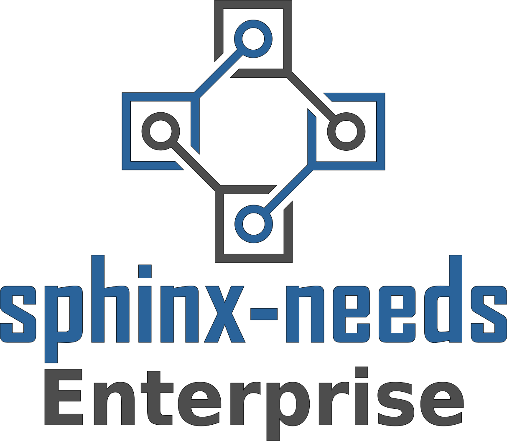

.. Sphinx-Needs Enterprise License documentation master file, created by
   sphinx-quickstart on Mon Sep 27 14:25:43 2021.
   You can adapt this file completely to your liking, but it should at least
   contain the root `toctree` directive.

Becoming reliable
=================

.. revealjs-break::
   :notitle:

What is Sphinx-Needs?
---------------------

A highly customizable, free and open ALM solution for **developers** to enhance their **productivity**
to a new **maximum**.

.. revealjs-section::
   :data-background-color: #ffcc00
   :data-background-transition: zoom

Features
~~~~~~~~

* Objects of different types
* Link objects
* Analyse objects with tables, flow and pie charts
* Define custom options, layout and styles
* Automate data calculation
* Im/Export data from/to external systems

➔ All as Docs-As-Code

Input
~~~~~

.. code-block:: rst

   Here is a requirement for **code quality**:

   .. req:: Python code must be PEP8 compliant
      :id: REQ_PY_PEP8
      :status: closed
      :tags: python, quality
      :style: yellow, red_border

      The python code of our product must follow
      `PEP8 <https://www.python.org/dev/peps/pep-0008/>`_.

Result
~~~~~~

Here is a requirement for **code quality**:

.. req:: Python code must be PEP8 compliant
   :id: REQ_PY_PEP8
   :status: closed
   :tags: python, quality
   :style: yellow, red_border

   The python code of our product must follow `PEP8 <https://www.python.org/dev/peps/pep-0008/>`_.

Analysis
~~~~~~~~
``.. needtable::``

.. needtable::
   :style: table

Analysis 2
~~~~~~~~~~
``.. needflow::``

.. image:: /_static/needflow_example_1.svg

Analysis 3
~~~~~~~~~~
``.. needpie::``

.. needpie::
   :labels: Requirements, Specifications, Tests
   :shadow:
   :explode: 0.2, 0, 0

   type == 'req'
   type == 'spec'
   type == 'test'

And Sphinx-Needs-Enterprise?
----------------------------
A collection of tools and scripts to embedded Sphinx-Needs inside companies tool environments.

➔ One-Stop-Shop of Truth

.. revealjs-section::
   :data-background-color: #2a639aff
   :data-background-transition: zoom

Connectors
~~~~~~~~~~
Im- and Export of data from:

* CodeBeamer
* Azure Boards
* Jira
* GitHub Enterprise
* ... any other tool with a REST API

File Handlers
~~~~~~~~~~~~~
Work with data formats like:

* ReqIF (e.g. supported by DOORS)
* Ms Excel/Word
* ... company specific tools

Databases
~~~~~~~~~
| Store, Retrieve and Analyse
| current and historical data:

* Open Needs DB
* ElasticSearch
* ... any other document-based DB

Viewers
~~~~~~~
Filter and analyse data across documentations and projects:

* Standalone needs viewer
* Embedded viewer for Sphinx documentations
* VS Code viewer
* ... any other IDE with Extension support

Editors
~~~~~~~
Write, link and configure Needs with technical support:

* VS Code Language Server
* Intellij / PyCharm Language Server

Theme
~~~~~
Custom Sphinx theme with company focused features:

* Embedded Viewers
* Additional areas for information

  * Static links to other tools
  * Badges for real-time data (e.g. build status)

* Enhancement for huge documentations:

  * Long, complex TOC and sidebars
  * Search across documentations

Additional solutions
~~~~~~~~~~~~~~~~~~~~
* Needs Comment Server
* Sphinx-Metadata (Page specific data)

Business Model
--------------
Why is it needed?

.. revealjs-section::
   :data-background-color: #4d4d4dff
   :data-background-transition: zoom

Challenges
~~~~~~~~~~
Sphinx-Needs is mainly used by process driven companies.

Users may not be allowed to support Open Source projects.

Users don't spend after-work hours.

➔ Tough community building

Challenges 2
~~~~~~~~~~~~
Fast reaction time may be needed.

Problems may be company specific and can't be openly discussed.

Maintenance shall be independent from customers and projects.

➔ An ongoing income is needed to get 1-2 full-time developers on it.

Business Source License
-----------------------
| An eventually Open Source license

.. revealjs-section::
   :data-background-color: #800080
   :data-background-transition: zoom

Eventually?
~~~~~~~~~~~

* It's **free** for ALL.

  * Except you fulfill the usage limitations (commercial usage).

* It's **open** after 4 years.

  * Released under GPL/MIT.
  * No usage limitations anymore.

* Open code, docs and issue tracker all the time.

Secured usages?
~~~~~~~~~~~~~~~

* Yes, but with textual hints only.

  * During installation.
  * In outputs, logs and maybe in results.

* Software will work all the time.
* But with on-the-fly license checks.

Offers
------

.. revealjs-section::
   :data-background-color: #207020
   :data-background-transition: zoom

| **Whatever is needed**
| Licenses, Support, Trainings
| and Development Service

License
~~~~~~~
* Access to enterprise features
* Support ongoing development of Sphinx-Needs
* Influence issue priorities
* Support via issue tracker

Support contract
~~~~~~~~~~~~~~~~
* Faster reaction time and bug fixes
* Company and user specific solutions
* SLA possible
* Additional contact via email, telephone and online meetings

Trainings
~~~~~~~~~
* Sphinx, Sphinx-Needs and Sphinx-Needs Enterprise
* For beginners, power users and developers
* Company specific integrations

`sphinx-needs.com/trainings <https://www.sphinx-needs.com/trainings>`_

Development service
~~~~~~~~~~~~~~~~~~~
* Company specific concepts and solutions
* Development, Maintenance, Operations
* From small scripts to complete tool chains
* Working inside company networks
* Responsible for topics, not only tech. solutions
* Temporary on-site contact

License types
-------------

* **Floating license**
* User based license¹
* Node based license¹

¹ if requested

Floating license
~~~~~~~~~~~~~~~~

.. math::

   \tiny{
   \text{ Licenses } = \text{ Users } *
   \frac {  \text{ User builds}} { \text{ Working time }}
   * \text{ Build duration}
   }

**Example**

.. math::

   50
   * \frac {6 \tiny{\text { Builds}}} { 10h * 60}
   * 5min
   = 2.5 => \text{ 3 Licenses }

Thanks
------

Example Data
~~~~~~~~~~~~

1
~

.. spec:: Use flake to check PEP8
   :id: SPEC_FLAKE
   :links: REQ_PY_PEP8
   :status: closed

2
~

.. test:: Quality tests
   :id: TEST_SW_QUALITY
   :links: SPEC_FLAKE
   :status: open

   Provides some test cases to check if "dirty" code
   gets detected by Flake8, which was introduces by
   :need:`SPEC_FLAKE`
