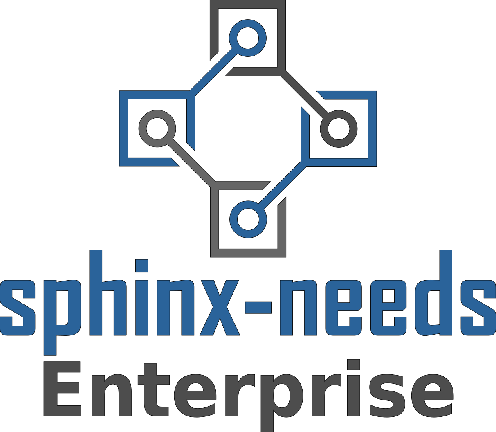

.. Sphinx-Needs Enterprise License documentation master file, created by
   sphinx-quickstart on Mon Sep 27 14:25:43 2021.
   You can adapt this file completely to your liking, but it should at least
   contain the root `toctree` directive.

License Open-Source?
====================

.. revealjs-section::
    :data-background-color: #222222

What is Sphinx-Needs?
---------------------

A highly customizable, free and open ALM solution for **developers** to enhance their **productivity** to a **maximum**.

Features
~~~~~~~~

* Objects of different types
* Link objects
* Analyse objects with tables, flow and pie charts
* Define custom options, layout and styles
* Automate data calculation
* Im/Export data from/to external systems

➔ All as Docs-As-Code

Input
~~~~~

.. code-block:: rst

   Here is a requirement for **code quality**:

   .. req:: Python code must be PEP8 compliant
      :id: REQ_PY_PEP8
      :status: closed
      :tags: python, quality
      :style: yellow, red_border

      The python code of our product must follow
      `PEP8 <https://www.python.org/dev/peps/pep-0008/>`_.

Result
~~~~~~

Here is a requirement for **code quality**:

.. req:: Python code must be PEP8 compliant
   :id: REQ_PY_PEP8
   :status: closed
   :tags: python, quality
   :style: yellow, red_border

   The python code of our product must follow `PEP8 <https://www.python.org/dev/peps/pep-0008/>`_.

Analysis
~~~~~~~~
``.. needtable::``

.. needtable::
   :style: table

Analysis 2
~~~~~~~~~~
``.. needflow::``

.. needflow::

Analysis 3
~~~~~~~~~~
``.. needpie::``

.. needpie::
   :labels: Requirements, Specifications, Tests
   :shadow:
   :explode: 0.2, 0, 0

   type == 'req'
   type == 'spec'
   type == 'test'

And Sphinx-Needs-Enterprise?
----------------------------
A collection of tools and scripts to embedded Sphinx-Needs inside companies tool environmens.

➔ One-Stop-Shop of Truth

Connectors
~~~~~~~~~~
Im- and Export of data from:

* CodeBeamer
* Azure Boards
* Jira
* GitHub Enterprise
* ... any other tool with a REST API

File Handlers
~~~~~~~~~~~~~
Work with data formats like:

* ReqIF (e.g. supported by DOORS)
* Ms Excel/Word
* ... company specific tools

Databases
~~~~~~~~~
| Store, Retrieve and Analyse
| current and historical data:

* Open Needs DB
* ElasticSearch
* ... any other document-based DB

Viewers
~~~~~~~
Filter and analyse data across documentations and projects:

* Standalone needs viewer
* Embedded viewer for Sphinx documentations
* VS Code viewer
* ... any other IDE with Extension support

Editors
~~~~~~~
Write, link and configure Needs with technical support:

* VS Code Language Server
* Intellij / PyCharm Language Server

Theme
~~~~~
Custom Sphinx theme with company focused features:

* Embedded Viewers
* Additional areas for information

  * Static links to other tools
  * Badges for real-time data (e.g. build status)

* Enhancement for huge documentations:

  * Long, complex TOC and sidebars
  * Search across documentations

Why is a business model needed?
------------------------------

Challenges
~~~~~~~~~~
Sphinx-Needs is mainly used by process driven companies.

Users may not be allowed to support Open Source projects.

Users don't spend after-work hours.

➔ Tough community building

Challenges 2
~~~~~~~~~~~~
Fast reaction time may be needed.

Problems may be company specific and can't be openly discussed.

Maintenance shall be independent from customers and projects.

➔ An ongoing income is needed to get 1-2 all-time developers on it.

Thanks
======

Example Data
-------------

1
~

.. spec:: Use flake to check PEP8
   :id: SPEC_FLAKE
   :links: REQ_PY_PEP8
   :status: closed

2
~

.. test:: Quality tests
   :id: TEST_SW_QUALITY
   :links: SPEC_FLAKE
   :status: open

   Provides some test cases to check if "dirty" code
   gets detected by Flake8, which was introduces by
   :need:`SPEC_FLAKE`
